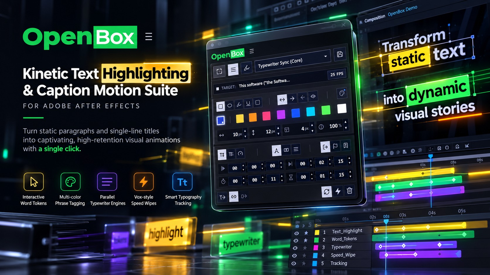
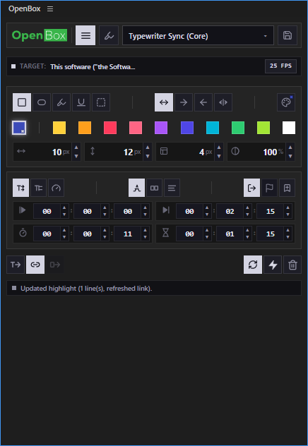
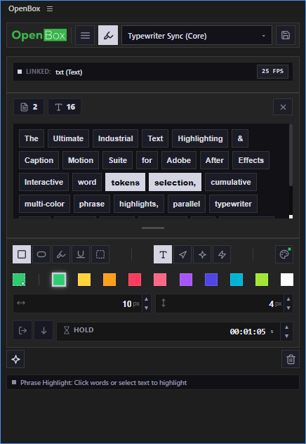
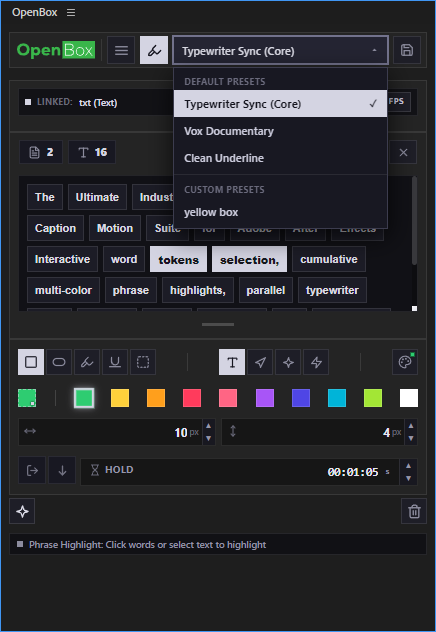

<p align="center">
  
</p>

<p align="center">
  
</p>

<h1 align="center">OpenBox v1.0.0</h1>

<p align="center">
  <strong>The Ultimate Industrial Text Highlighting & Caption Motion Suite for Adobe After Effects</strong><br/>
  <strong>أقوى حزمة احترافية لصناعة تأثيرات الهايلايت الحركية والكابشنز لبرنامج أدوبي أفتر إفكتس</strong><br/>
  <sub>Interactive word tokens selection, cumulative multi-color phrase highlights, parallel typewriter suite, Hormozi elastic dynamics, Vox speed-ramp wipes, mathematical single-line centering, and zero-distortion typography tracking.</sub>
</p>

<p align="center">
  <a href="#-quick-start--دليل-التثبيت-السريع"></a>
  <a href="LICENSE"></a>
  <a href="#-compatibility--متطلبات-التشغيل"></a>
  <a href="#"></a>
  <a href="#-test-suite--منظومة-الاختبارات"></a>
  <a href="#"></a>
</p>

<p align="center">
  <a href="#english-guide"><b>English Guide</b></a> •
  <a href="#arabic-guide"><b>الدليل باللغة العربية</b></a>
</p>

---

## 📸 Interface Overview • نظرة شاملة على واجهة الإضافة

<table align="center" width="100%">
  <tr>
    <td width="33.33%" align="center" valign="top">
      <h4><b>1. Paragraph & Lines View<br/>التحكم بالأسطر والفقرات</b></h4>
      <a href="assets/screenshots/openbox_01.png">
        
      </a>
      <br/>
      <sub><b>Execution & Full Lines:</b> Cascading highlights, direction controls (LTR/RTL/Center), 4-in-1 metric inputs, and segmented timecodes.</sub><br/>
      <sub><b>التنفيذ والأسطر الكاملة:</b> هايلايت متسلسل، تحديد الاتجاه، خانات القياس المدمجة، وعدادات التوقيت المجزأة.</sub>
    </td>
    <td width="33.33%" align="center" valign="top">
      <h4><b>2. Interactive Words Board<br/>لوحة الكلمات التفاعلية</b></h4>
      <a href="assets/screenshots/openbox_02.png">
        
      </a>
      <br/>
      <sub><b>Phrase & Word Tokens:</b> Interactive clickable word tokens board, multi-word selection, cumulative colors & instant click-to-erase.</sub><br/>
      <sub><b>تحديد العبارات والكلمات:</b> بطاقات كلمات تفاعلية قابلة للنقر، سحب لتحديد عبارات، ألوان تراكمية ومسح فوري.</sub>
    </td>
    <td width="33.33%" align="center" valign="top">
      <h4><b>3. Presets & Styles System<br/>قائمة التأثيرات المحفوظة</b></h4>
      <a href="assets/screenshots/openbox_03.png">
        
      </a>
      <br/>
      <sub><b>Styles & Presets:</b> Instant built-in presets (Typewriter Sync, Vox Documentary, Clean Underline) + 1-click custom preset saving.</sub><br/>
      <sub><b>التأثيرات والقوالب:</b> قوالب نظامية مدمجة وسريعة + حفظ التأثيرات المخصصة واسترجاعها بضغطة زر واحدة.</sub>
    </td>
  </tr>
</table>

---

<div id="english-guide"></div>

## 🌟 English User & Developer Guide

### 💡 Why OpenBox?
Highlighting subtitles, kinetic typography, and documentary quotes in Adobe After Effects has traditionally required tedious shape layer positioning, cumbersome track mattes, or complex manual expression rigging.

**OpenBox** redefines this workflow entirely with an **industrial CEP extension** engineered for professional editors, motion graphic designers, and social content creators:
- **Zero Text Distortion**: Highlighting happens without injecting brackets `[...]` or modifying your `Source Text`.
- **Single-Line & Multi-Line Mathematical Centering**: Single lines center with pixel-exact symmetry ($TopPad = BottomPad = pY$), while multi-line paragraphs distribute leading seamlessly.
- **Dynamic Leading Tracking**: Shapes dynamically adapt at runtime if you adjust the text's Leading or Font Size inside After Effects without rebuilding.
- **Full BiDi & International Support**: Native support for **Arabic**, **Hebrew**, **Latin**, mixed BiDi, and justified paragraphs.
- **Industrial Slate Aesthetic**: Sharp architectural design, high-contrast palette, unified top-bar, and 4-in-1 metric inputs with horizontal scrubbing.

---

### 🎬 Core Features

#### 🔤 1. Interactive Word Tokens Board & Phrase Highlighting
- **Live Text Parsing**: Automatically scans the active AE text layer and populates an interactive words board.
- **Click & Drag Multi-Selection**: Select single words, drag across multiple tokens, or use `Shift + Click` for contiguous ranges.
- **Cumulative Multi-Color Highlights**: Apply emerald green to key nouns, amber yellow to verbs, and coral crimson to dates—all on the same text layer without clearing previous phrases.
- **Click-to-Erase Engine**: Clicking an already highlighted word in the tokens board instantly removes its highlight from After Effects.
- **Live Token Metrics**: Instant counter badges for selected word count and character count.
- **Resizable Tokens Workspace**: Integrated vertical grip handle to drag and expand the tokens board for lengthy paragraphs.

#### ⌨️ 2. Advanced Typewriter Motion Suite
- **Sequential Line Cascading (`sequential`)**: Classic stepped line-by-line typewriter flow where each line starts only after the previous one completes.
- **Parallel Concurrent Lines (`parallel`)**: All lines animate simultaneously in parallel, ideal for fast captions, lower thirds, and punchy quote reveals.
- **Constant Word Speed (`constant`)**: Realistic reading pace where all words animate at equal speeds—naturally shorter lines finish typing earlier.
- **Synchronized Line Finish (`synced`)**: Every line completes typing at the exact same instant regardless of length, creating a crisp, synchronized arrival.

#### 🎢 3. Physics-Based Motion Dynamics
- **Hormozi Elastic Overshoot (`pop`)**: Mathematically continuous harmonic damped spring bounce that settles cleanly to 100% with zero frame popping.
- **Vox Speed-Ramp (`wipe`)**: Punchy 25% attack followed by silky 80% cinematic deceleration inspired by modern investigative video journalism.
- **Snap Jump Cut (`snap`)**: 0-frame instantaneous jump cut for high-energy social reels, TikTok, and YouTube Shorts captioning.

#### ⏱️ 4. Segmented Timecode & Outro Timing
- **Segmented Precision Inputs**: Direct `[MM : SS : FF]` timecode manipulation with dynamic composition frame-rate switching (24, 25, 29.97, 30, 60 FPS).
- **Outro Animation Suite**: Configurable exit transitions with reverse or forward order toggling (`1➔N` vs `N➔1`).
- **Hold Duration**: Precise hold timer before phrase auto-dismissal.
- **Marker Synchronization**: Automatic audio marker triggering for lyric sync and speech alignment.

#### 💾 5. Custom Presets System
- **1-Click Save**: Store your favorite combination of shape, color, padding, radius, and motion dynamics with one click (`💾`).
- **LocalStorage Persistence**: Custom presets survive panel reloads and After Effects restarts.
- **Integrated Delete**: Instant preset management with clean deletion (`✕`).

---

<div id="arabic-guide"></div>

## 🌍 الدليل الشامل باللغة العربية (Arabic User Guide)

### 💡 ما هي إضافة OpenBox ولماذا صُنعت؟
إنشاء تأثيرات الهايلايت للنصوص، والكابشنز السريعة للفيديوهات القصيرة (Shorts & Reels)، والاقتباسات الوثائقية داخل **Adobe After Effects** كان يتطلب في السابق ساعات من العمل اليدوي المرهق: إنشاء طبقات أشكال متعددة، ربط الـ Track Mattes، أو كتابة معادلات Expression معقدة.

جاءت إضافة **OpenBox** لتعيد تعريف هذا المسار بالكامل عبر لوحة تحكم ذكية وخارقة السرعة:
* **نظافة تامة للنص (Zero Distortion):** يتم تمييز النصوص والكلمات دون إضافة أقواس غريبة أو تشويه النص الأصلي في الـ Source Text.
* **تمركز هندسي وبصري مثالي:** تم حل معضلة السطر الواحد؛ حيث يتوسط النص داخل الصندوق بدقة المليمتر مع تطابق كامل للحواشي العلوية والسفلية ($Top = Bottom = pY$).
* **تتبع ديناميكي للمسافات (Dynamic Leading):** إذا قمت بتغيير حجم الخط أو تباعد الأسطر (Leading) داخل After Effects، تتكيف الصناديق تلقائياً دون الحاجة لإعادة إنشاء الهايلايت!
* **دعم أصيل للغة العربية:** دعم كامل للكتابة من اليمين لليسار (RTL)، والمحاذاة، والتمديد (الكشيدة)، والنصوص المختلطة (عربي + إنجليزي).
* **تصميم عصري متطور:** واجهة مدمجة بسطر علوي موحد، وخانات قياس 4 في 1 مع إمكانية السحب الأفقي للفأرة لتعديل القيم فورياً.

---

### 🎬 أهم المميزات وطريقة الاستخدام

#### 1. لوحة الكلمات التفاعلية (Interactive Word Tokens)
1. اختر أي طبقة نصية في التكوين (Composition) واضغط على تبويب الكلمات (`🖊`).
2. ستظهر لك كلمات النص مقسمة في شكل بطاقات (Tokens) تفاعلية.
3. انقر على أي كلمة أو اسحب الفأرة لتحديد مجموعة كلمات معاً.
4. اختر اللون ونوع الحركة ثم اضغط **Apply** ليتم تلوينها فوراً في المشهد!
5. يمكنك تلوين الكلمة الأولى بالأخضر، والثانية بالأصفر، والثالثة بالأحمر على نفس الطبقة دون أي تداخل!
6. **مسح فوري بضغطة زر:** بالنقر على أي كلمة تم تمييزها مسبقاً في اللوحة، يتم حذف الهايلايت الخاص بها فوراً من After Effects.

#### 2. حركات الآلة الكاتبة الذكية (Typewriter Suite)
* **المتتالي (Sequential):** طباعة السطر تلو السطر الكلاسيكية.
* **المتوازي (Parallel):** كتابة جميع الأسطر معاً في نفس الوقت، وهو الخيار الأنسب للكابشنز وعناوين الأخبار السريعة.
* **السرعة الثابتة (Constant Speed):** سرعة قراءة بشرية واقعية تنهي الأسطر القصيرة أولاً.
* **النهاية المتزامنة (Synced):** تنهي جميع الأسطر حركتها في نفس الإطار بدقة بالغة.

#### 3. أنماط الحركة الاحترافية (Motion Dynamics)
* **Wipe (حركة وثائقية ناعمة):** انطلاقة سريعة بنسبة 25% مع تباطؤ سينمائي ناعم بنسبة 80% مستوحى من أسلوب تحقيقات قناة Vox.
* **Pop (الارتداد المرن):** ارتداد زنبركي نابض بالحياة مستوحى من أسلوب Alex Hormozi لجذب انتباه المشاهد في أول ثوانٍ.
* **Snap (الظهور الفوري):** قطع مباشر وسريع بدون إطارات انتقالية لفيديوهات التيك توك وريلز سريعة الإيقاع.

---

## 🚀 Quick Start & Installation • دليل التثبيت السريع

### 1. استنساخ المستودع (Clone Repository)
قم بنسخ المستودع إلى جهازك المحلي:
```bash
git clone https://github.com/wittybrandcode/OpenBox.git
```

### 2. نسخ المجلد إلى مسار إضافات أدوبي (Copy to CEP Directory)
انسخ مجلد `OpenBox` بالكامل إلى مسار إضافات CEP المناسب لنظام تشغيلك:

| نظام التشغيل (OS) | المسار الهدف (Target Path) |
|---|---|
| **Windows** | `C:\Program Files (x86)\Common Files\Adobe\CEP\extensions\OpenBox` |
| **macOS** | `/Library/Application Support/Adobe/CEP/extensions/OpenBox` |

> [!TIP]
> لمستخدمي Windows، يمكن أيضاً التثبيت في مسار المستخدم الخاص:  
> `%APPDATA%\Adobe\CEP\extensions\OpenBox`

### 3. تفعيل وضع التطوير (Enable PlayerDebugMode)
نظراً لأن الإضافة مفتوحة المصدر، يلزم تفعيل وضع `PlayerDebugMode` لمرة واحدة فقط لتشغيل إضافات CEP:

#### على نظام Windows (باستخدام PowerShell كمسؤول):
```powershell
7..12 | ForEach-Object {
    reg add "HKCU\Software\Adobe\CSXS.$_" /v PlayerDebugMode /t REG_SZ /d "1" /f
}
```

#### على نظام macOS (باستخدام Terminal):
```bash
defaults write com.adobe.CSXS.7 PlayerDebugMode 1
defaults write com.adobe.CSXS.8 PlayerDebugMode 1
defaults write com.adobe.CSXS.9 PlayerDebugMode 1
defaults write com.adobe.CSXS.10 PlayerDebugMode 1
defaults write com.adobe.CSXS.11 PlayerDebugMode 1
defaults write com.adobe.CSXS.12 PlayerDebugMode 1
```

### 4. التشغيل داخل After Effects
1. افتح أو أعد تشغيل برنامج **Adobe After Effects** (من إصدار CC 2017 وحتى 2026+).
2. من القائمة العلوية توجه إلى: **Window** → **Extensions** → **OpenBox**.
3. اسحب النافذة وضعها في المكان المناسب لمساحة عملك.

---

## ⌨️ Shortcuts & Controls • الاختصارات والتحكم

| الاختصار (Shortcut) | الوظيفة (Action) |
|---|---|
| `F5` / `Ctrl + R` | إعادة تحميل الواجهة وقراءة حالة التكوين الحالية |
| `Ctrl + Shift + D` | إظهار / إخفاء نافذة الفحص البرمجي للمطورين (**Debug Console**) |
| `النقر المزدوج على شريط الحالة` | إظهار / إخفاء نافذة المطورين (**Debug Console**) |
| `Shift + Click` على الكلمات | تحديد نطاق متصل من الكلمات في لوحة العبارات |
| `السحب بالفأرة` على الكلمات | تحديد متعدد وسريع للكلمات بالسحب المتواصل |
| `النقر على كلمة محددة` | مسح فوري للهايلايت الخاص بتلك الكلمة من المشهد |
| `السحب الأفقي على الأيقونات` | تغيير القيم بسرعة وسلاسة (`Pad X`, `Pad Y`, `Radius`, `Opacity`) |
| `Shift + النقر على الأسهم` | تعديل القيمة بخطوة مضاعفة (10× Step) |
| `Alt + النقر على الأسهم` | تعديل القيمة بخطوة دقيقة (0.1× Micro-step) |

---

## 🏗️ Technical Architecture • البنية المعمارية للمشروع

تتبع إضافة **OpenBox** نموذجاً معمارياً معزولاً ومنظماً يفصل بين واجهة المستخدم المبنية بتقنيات الويب (CEP UI) ومحرك التشغيل البرمجي لأدوبي (ExtendScript Engine):

```
OpenBox/
├── CSXS/
│   └── manifest.xml              # ملف تعريف الإضافة لأدوبي (CC 2017 - 2026+)
├── client/
│   ├── index.html                # الهيكل البصري وعناصر الواجهة
│   ├── css/
│   │   └── style.css             # نظام التصميم الاحترافي الداكن ومؤثرات الحركة
│   ├── assets/
│   │   └── logo_openbox.svg      # الشعار الرسمي المعتمد في الهيدر
│   └── js/
│       ├── CSInterface.js        # جسر الاتصال الرسمي بين المتصفح وAfter Effects
│       ├── core/
│       │   ├── Config.js         # الإعدادات الافتراضية
│       │   ├── State.js          # إدارة الحالة التفاعلية (Reactive Store)
│       │   ├── DOM.js            # مراجع عناصر الواجهة المخبأة
│       │   ├── TimeEngine.js     # محرك حساب وتفكيك التايم كود والإطارات
│       │   └── Bridge.js         # وسيط التوجيه واستدعاء دوال الـ Host
│       ├── services/
│       │   ├── SyncService.js    # محرك التزامن اللحظي المزدوج
│       │   └── Actions.js        # معالجة أوامر التطبيق، المسح، وحفظ القوالب
│       ├── modules/
│       │   ├── Controls.js       # عناصر التحكم، الأسهم، السحب، ولوحة الألوان
│       │   ├── PresetsManager.js # إدارة القوالب وحفظها في التخزين المحلي
│       │   └── PhraseManager.js  # لوحة الكلمات التفاعلية وتحديد العبارات
│       └── app.js                # نقطة الانطلاق وبدء تشغيل اللوحة
├── host/
│   ├── hostscript.jsx            # المدخل الرئيسي لمحرك ExtendScript
│   └── modules/
│       ├── Config.jsx            # ثوابت المحرك ونماذج الـ Expressions
│       ├── Utils.jsx             # معالجة المصفوفات، الألوان، وJSON لنظام ES3
│       ├── TextScanner.jsx       # تحليل أسطر النص، المحاذاة، والـ BiDi
│       ├── InvisibleAnchors.jsx  # نظام النقاط المرجعية غير المدمر
│       ├── HighlightBuilder.jsx  # بناء طبقات الأشكال وربط متحكمات الماستر
│       ├── TagManager.jsx        # إدارة تمييز الكلمات والعبارات التراكمية
│       ├── TypewriterEngine.jsx  # محرك أنيميتور الآلة الكاتبة المتناسب
│       ├── Recipes.jsx           # بنية الوصفات المفتوحة (Styles & Motions)
│       └── ControllerBridge.jsx  # المزامنة المباشرة وتنظيف الطبقات
├── assets/
│   ├── hero_banner.jpg           # البانر الترويجي عالي الدقة (4K)
│   ├── SVG/
│   │   └── logo_openbox.svg      # الشعار المتجهي الرسمي
│   └── screenshots/
│       ├── openbox_01.png        # لقطة واجهة الأسطر والفقرات
│       ├── openbox_02.png        # لقطة واجهة اختيار العبارات والكلمات
│       └── openbox_03.png        # لقطة قائمة التأثيرات المحفوظة
├── tests/
│   ├── run_all.js                # مشغل حزمة الاختبارات الشاملة فائقة السرعة
│   ├── unit/                     # اختبارات التايبوغرافي، الوصفات، والتايم كود
│   └── integration/              # اختبارات سلامة الـ Expressions والـ Undo
├── LICENSE                       # رخصة المشروع (MIT)
├── package.json                  # بيانات المشروع وسكربتات الفحص
└── README.md                     # التوثيق الشامل ثنائي اللغة
```

---

## 🧪 Test Suite • منظومة الاختبارات الآلية

يحتوي المشروع على حزمة اختبارات شاملة ذاتية التشغيل لا تعتمد على حزم خارجية لضمان سلامة كافة القواعد الرياضية:
```bash
npm test
```
```text
═══════════════════════════════════════════════════════════════
  OPENBOX — MASTER TEST SUITE (PRODUCTION HARNESS)
═══════════════════════════════════════════════════════════════
  ✓ LTR / RTL / Justified Alignment Invariants
  ✓ Dynamic Leading Tracking (lineIndex * linePitch)
  ✓ Single-Line Vertical Centering & Strict Padding Symmetry
  ✓ Timecode & FPS Conversion Bijective Invariants
  ✓ Open-Closed Recipe Extensibility Architecture
  ✓ Expression AST & Division-by-Zero Safety Resilience
  ✓ Zero Undo-Leaks & Perfectly Balanced Groups
  ✓ Full Codebase Syntax & AST Validation (31 files)
═══════════════════════════════════════════════════════════════
  🎉 ALL 6 TEST SUITES PASSED (100% PASS)
═══════════════════════════════════════════════════════════════
```

---

## 🔌 Compatibility • متطلبات التشغيل

| المواصفة (Specification) | المتطلب (Requirement) |
|---|---|
| **البرنامج المضيف (Host App)** | Adobe After Effects CC 2017 (v14.0) وحتى 2026+ |
| **محرك CEP** | إصدار CSXS 7.0 فما فوق |
| **نظام التشغيل (Operating System)** | Windows 10, Windows 11 / macOS 10.14+ (Intel & Apple Silicon M1/M2/M3/M4) |
| **المعمارية (Architecture)** | 64-bit |

---

## 📄 License • الترخيص

هذا المشروع مرخص تحت رخصة **MIT** مفتوحة المصدر — راجع ملف [LICENSE](LICENSE) لمزيد من التفاصيل.

---

<p align="center">
  صُنع بكل إتقان واحترافية لمجتمع الموشن جرافيك والمونتيرين وصناع المحتوى حول العالم.<br/>
  Crafted with precision for motion graphic artists and video editors worldwide.<br/>
  <strong>OpenBox Team © 2026</strong>
</p>
